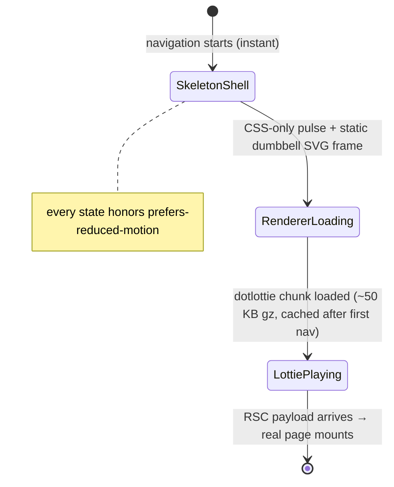

# PRD: Route Loading Experience with Dumbbell Lottie Animation

**Project:** SimpleFitnessv2 · **Scope:** `src/app/(journal)/loading.tsx` + supporting component · **Status:** Draft

---

## 1. Problem

Every route in the journal group is `force-dynamic` with fully-awaited data fetches, so client-side navigation freezes the old page for 1.5–2 s (the `_rsc` fetches seen in DevTools). Because there is no `loading.tsx`, Next.js has no boundary to show and nothing useful to prefetch — the UI blocks until the server render completes.

## 2. Goals

1. **Instant perceived navigation** — clicking a nav link immediately shows a loading state inside the content column; the shell (header, side nav, streak chip, mobile nav) never flickers or shifts.
2. **Brand-consistent waiting state** — a minimal, line-art dumbbell animation (the `.lottie` asset) as the centerpiece, plus quiet skeleton placeholders that mirror real page structure.
3. **Zero layout shift** when real content replaces the skeleton.
4. **Re-enable prefetching** — with a loading boundary present, Next.js prefetches dynamic routes on hover/viewport, cutting future navigation cost.
5. **Respect theme (dark/light) and** `prefers-reduced-motion`**.**


### Non-goals

- Fixing the underlying DB latency (separate effort: query flattening, de-duplicated streak, Suspense streaming).
- Per-route bespoke skeletons (v2 — one generic skeleton covers today/progress/history/library).
- Root `app/loading.tsx` (auth redirect and login flow keep default behavior).

---


## 3. Design


### 3.1 Layout

`loading.tsx` renders **inside** `<main class="content-column">` as a child of `JournalShell`, so the chrome stays fully interactive:

```
┌ header: brand · date · streak · theme · logout ┐  ← stays visible
├──────────┬─────────────────────────────────────┤
│ side nav │  content-column (loading replaces)  │
│  stays   │  ┌───────────────────────────────┐  │
│          │  │  ▲ dumbbell line-art (Lottie) │  │
│          │  │  centered, ~112px, accent     │  │
│          │  └───────────────────────────────┘  │
│          │  ▓▓▓▓▓▓ title bar  (~2.2rem w 40%)  │
│          │  ┌────┐ ┌────┐ ┌────┐  stat cards   │
│          │  └────┘ └────┘ └────┘               │
│          │  ┌─────────────────────────────┐    │
│          │  │ ── panel: 2 list rows + bar │    │
│          │  └─────────────────────────────┘    │
└──────────┴─────────────────────────────────────┘
mobile: same stack, mobile-nav stays visible
```

- Wrapper: `min-height: 56vh` so short pages don't jump when content arrives.
- Skeleton uses existing tokens only: `--surface`, `--surface-strong`, `--ink-soft` at reduced opacity; accent `#E8402C` reserved for the dumbbell.


### 3.2 Animation spec


| Property       | Value                                                                                                                                                                              |
| -------------- | ---------------------------------------------------------------------------------------------------------------------------------------------------------------------------------- |
| Asset          | `lib/animations/dumbbell.lottie` (line-art dumbbell lift)                                                                                                                          |
| Display size   | 112 × 112 px (72 px on ≤480 px)                                                                                                                                                    |
| Color          | Recolor the lottie's stroke to `--accent` (#E8402C) **in the source file** — the accent is identical in dark and light themes, so one asset serves both with no runtime recoloring |
| Loop           | `loop: true, autoplay: true`                                                                                                                                                       |
| Framerate      | As authored (target: 1.5–3 s loop, slow enough to feel calm)                                                                                                                       |
| Reduced motion | `prefers-reduced-motion: reduce` → first frame only, `autoplay: false`                                                                                                             |
| Microcopy      | None on screen. `aria-label` handles accessibility                                                                                                                                 |
| Fade-in        | 150 ms CSS `animation-delay` on the loader block so fast loads (<150 ms, post-prefetch) don't flash                                                                                |


### 3.3 Skeleton spec

One generic composition that approximates all four routes:

1. **Title bar** — 40% width × 2.2rem, radius 8px.
2. **Stat card row** — 3 cards (2 on mobile), each with a 60%-width label bar and a taller value bar.
3. **Panel** — full-width surface card with two list rows (avatar circle + two bars) and one wide progress bar.
4. Pulse animation: `opacity 0.55 → 0.9`, 1.4 s ease-in-out infinite alternate; disabled under reduced motion.


### 3.4 States




---


## 4. Technical spec


### 4.1 Dependency

`.lottie` is a dotLottie archive (zipped), which `lottie-react` cannot read. Use `@lottiefiles/dotlottie-react` (official renderer, plays `.lottie` and `.json`, ~50 KB gzipped core loaded once and cached).

```bash
npm i @lottiefiles/dotlottie-react
```


### 4.2 Files


| Path                                | Purpose                                                                       |
| ----------------------------------- | ----------------------------------------------------------------------------- |
| `public/animations/dumbbell.lottie` | The pasted asset (recolored to `#E8402C`)                                     |
| `src/app/(journal)/loading.tsx`     | Server component, one-line export                                             |
| `src/components/route-loading.tsx`  | `"use client"` — skeleton + lazy-loaded Lottie                                |
| `src/app/globals.css`               | `.route-loading` styles, skeleton pulse keyframes, reduced-motion media query |


### 4.3 Component sketch

```tsx
// src/app/(journal)/loading.tsx
import { RouteLoading } from "@/components/route-loading";
export default function Loading() {
  return <RouteLoading />;
}
```

```tsx
// src/components/route-loading.tsx
"use client";
import dynamic from "next/dynamic";
import { useEffect, useState } from "react";

// Renderer chunk loads off the critical path; static SVG frame shows meanwhile.
const DotLottieReact = dynamic(
  () => import("@lottiefiles/dotlottie-react").then((m) => m.DotLottieReact),
  { ssr: false }
);

export function RouteLoading() {
  const [reduced, setReduced] = useState(false);
  useEffect(() => {
    const mq = matchMedia("(prefers-reduced-motion: reduce)");
    setReduced(mq.matches);
    return () => mq.removeEventListener("change", () => {});
  }, []);

  return (
    <div
      className="route-loading"
      role="status"
      aria-live="polite"
      aria-busy="true"
      aria-label="Loading your training data"
    >
      <div className="route-loading-mark" aria-hidden="true">
        {/* fallback: static inline SVG dumbbell line-art (stroke=var(--accent)) */}
        <DotLottieReact
          src="/animations/dumbbell.lottie"
          loop={!reduced}
          autoplay={!reduced}
        />
      </div>
      <div className="skeleton-title" />
      <div className="skeleton-cards">{/* 3 × .skeleton-card */}</div>
      <div className="skeleton-panel">{/* rows + bar */}</div>
    </div>
  );
}
```

Notes:

- `loading.tsx` itself must stay a **server component** with the client island inside — keeps the fallback renderable before any JS ships.
- The inline SVG fallback (static dumbbell outline) prevents a blank box during the one-time renderer download; it can double as the reduced-motion frame.
- Keep the whole block inside the content column — never wrap the page in the loader; the shell must not re-render.


### 4.4 Performance budget


| Metric                    | Budget                                                                      |
| ------------------------- | --------------------------------------------------------------------------- |
| `dumbbell.lottie` size    | ≤ 150 KB (line art should compress well; re-export without embedded images) |
| dotlottie renderer chunk  | loaded once, lazy, ~50 KB gz — never on the initial page bundle             |
| First paint of skeleton   | < 50 ms after navigation start (pure CSS, no JS required)                   |
| CLS when content swaps in | 0 within the content column (shell reserved by `min-height: 56vh`)          |


---


## 5. Accessibility

- `role="status"` + `aria-live="polite"` + `aria-busy` on the wrapper; `aria-label="Loading your training data"`.
- Skeleton divs are `aria-hidden`; animation container `aria-hidden`.
- `prefers-reduced-motion`: no lottie autoplay, no skeleton pulse.
- Focus stays where it was (loader is not focusable; nav links remain focusable/active).


## 6. Acceptance criteria

1. Clicking Today / Progress / History / Library shows the shell **unchanged** and the skeleton + dumbbell within one frame — old page never appears frozen.
2. Browser back/forward and repeated navigations benefit from prefetch; subsequent loads feel near-instant on fast DB responses.
3. Dark and light themes both render correctly with a single `.lottie` asset.
4. `prefers-reduced-motion: reduce` disables all animation, shows static frame.
5. No hydration warnings, no ESLint violations, `npm run typecheck` passes.
6. Total added weight to JS bundles ≤ 60 KB gz after first visit; asset ≤ 150 KB.
7. DevTools "Slow 3G" + 6× CPU throttle: skeleton still paints immediately.


## 7. Milestones

1. **M1** — Add dependency, paste asset into `public/animations/`, recolor to accent.
2. **M2** — `route-loading.tsx` + `loading.tsx` + CSS skeleton.
3. **M3** — A11y + reduced-motion + lazy-loading polish.
4. **M4** — Verify against acceptance criteria in dev **and** a production build (`next build && next start` — dev mode exaggerates load times).


## 8. Open questions

1. **Asset delivery** — paste the `.lottie` as-is, or extract the inner JSON and inline it (zero fetch, but ships in the client bundle)? Default: keep it in `/public`.
2. Should `library` get a distinct skeleton (grid of cards) in v2?
3. Once the DB latency work lands (Suspense streaming), consider demoting the dumbbell to only the *initial* app load and using plain skeletons for navigations — decide after measuring post-prefetch timings.

